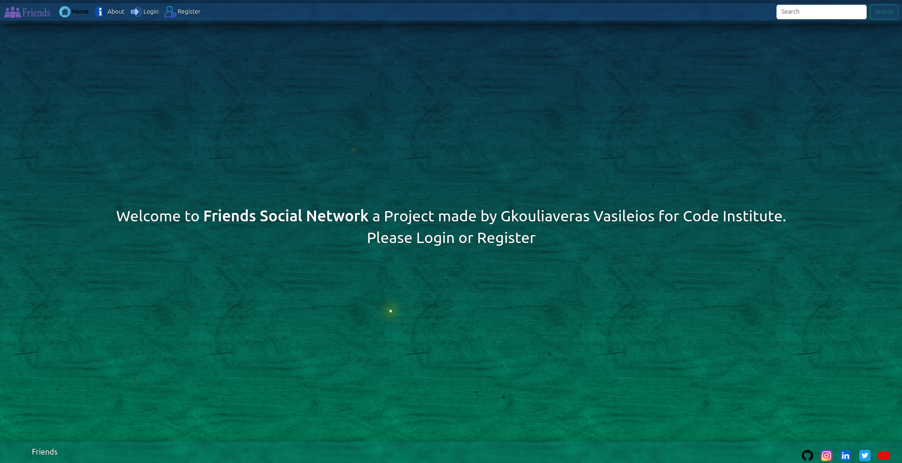
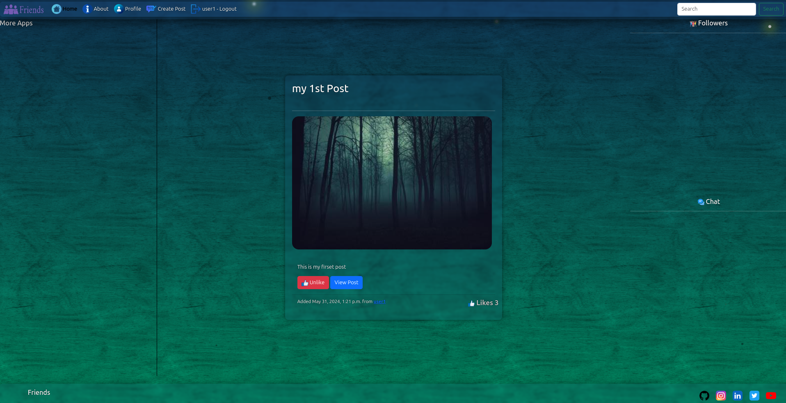
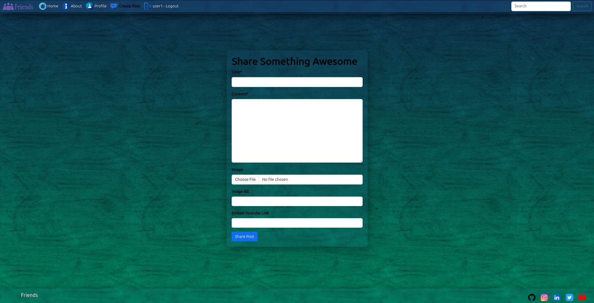
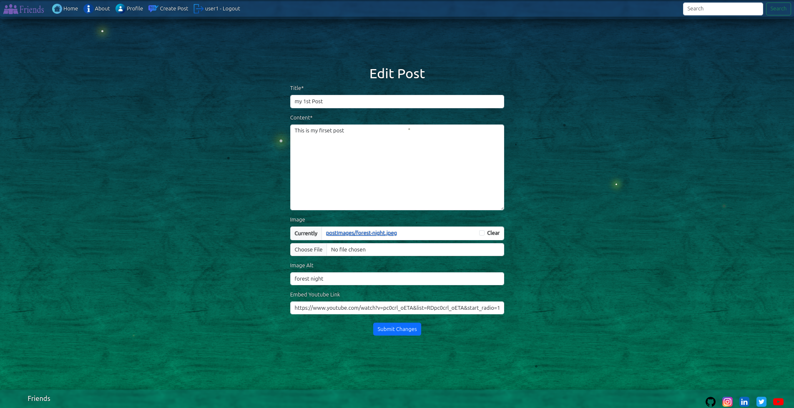
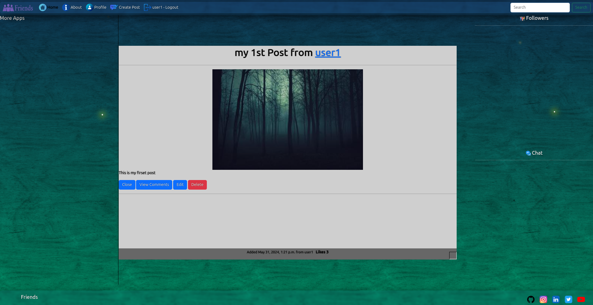
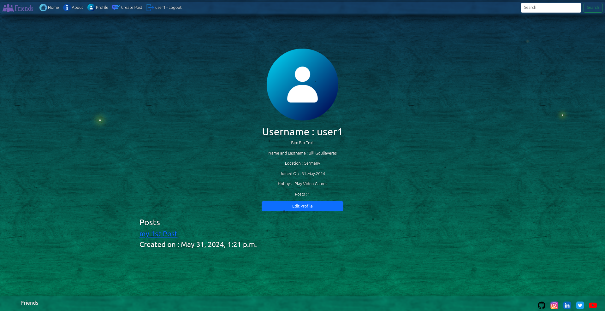
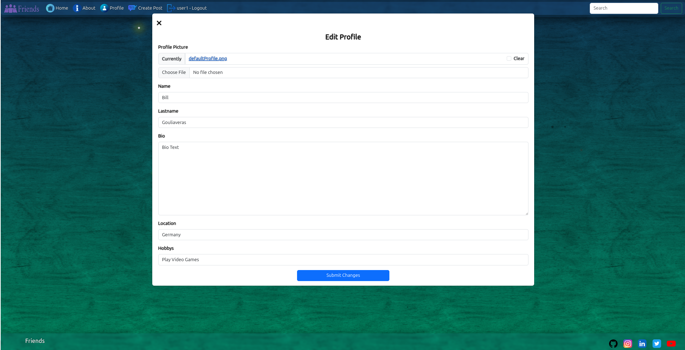
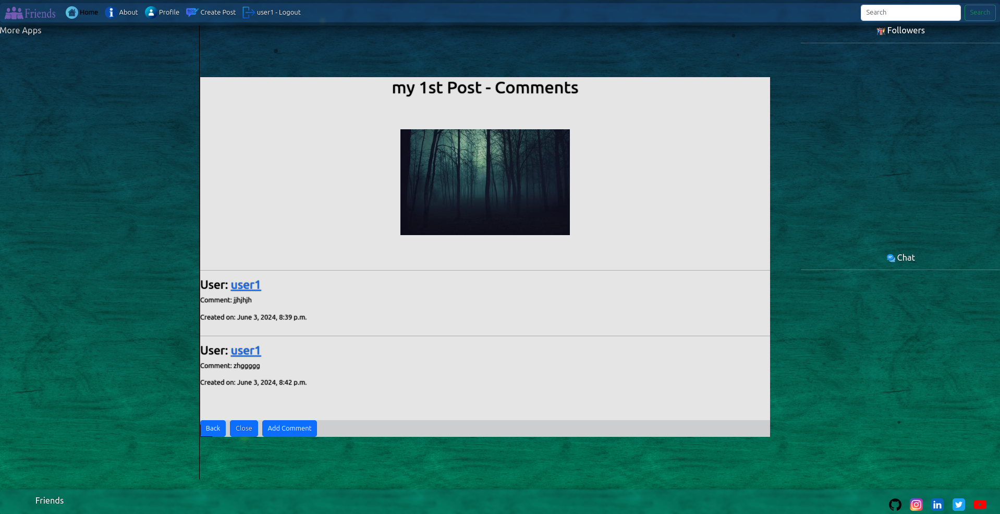
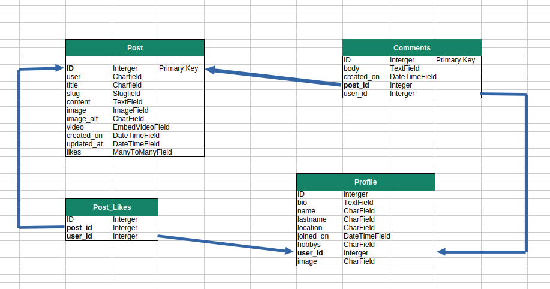

  

<strong>Friends</strong> is a Social Network and Blog site, to share Media make friends and chat in rooms or private Join us to post your favorites pictures or videos  and leave a comment !

Visit :arrow_right:<a href="http://patchwerk.ddns.net/">Friends Website</a>

## Features

- **Share Media:** Share Images private for friends only or public for all
- **Connect with friends:** Leave a Comment or chat in the room or private
- **Profile:** Customize your personal profile
- **Like:** Press the like button if you like a post
---

## User Stories

## 1. User Registration
- **As a** new visitor  
- **I want to** register for an account by providing my email, username, and password  
- **So that** I can access additional features like logging in and posting comments  
---

## 2. User Login
- **As a** registered user  
- **I want to** log in by entering my username/email and password  
- **So that** I can access my account and participate in commenting  
---

## 4. Post Comment
- **As a** logged-in user  
- **I want to** post a comment on a blog post or article  
- **So that** I can share my opinion and engage with the content  
---

## 5. View Comments
- **As a** visitor or user  
- **I want to** view all comments on a blog post or article  
- **So that** I can read what other people are saying about the content  
---

## 6. Edit Comment
- **As a** logged-in user  
- **I want to** edit a comment I previously posted  
- **So that** I can correct mistakes or update my opinion  
---

## 7. Delete Comment
- **As a** logged-in user  
- **I want to** delete a comment I previously posted  
- **So that** I can remove content that I no longer want to be visible  
---

## 9. Like/Dislike Comment
- **As a** logged-in user  
- **I want to** like or dislike other users’ comments  
- **So that** I can express my agreement or disagreement with their opinions  
---

## 10. View Profile
- **As a** logged-in user  
- **I want to** view my profile page, including my comments and account settings  
- **So that** I can see my activity and manage my account  
---

## 11. User Logout
- **As a** logged-in user  
- **I want to** log out of the website  
- **So that** I can ensure no one else can use my account from this device  
---

### Acceptance Criteria:
- A "logout" option is visible when the user is logged in.
- The user is logged out of their session after clicking the logout button.
### Agile Development

This project followed an agile methodology using github project.

## Design

### Colors and Background
The Background image is from a online generator site Thanks to [ZenBQ](https://galactic.ink/bg/)

### Typography
Open Sans font is used

### Icons 
- **Icons:** are from [FLATICON](https://www.flaticon.com/)
- **Favicon:** are from [Favicon Generator](https://favicon.io/favicon-converter/)

## User Experience

### Pages

- **Welcome**

- **After login**

- **Create Post**

- **Edit Post**

- **View Post**

- **User Profile**

- **Edit Profile**

- **View Comments**

- **Add Comment**
[!Add Comment](readme/images/addComment.png)

##Technologies

### Backend

- **Python:** The main programming language for backend development.
- **Django:** The backend python framework.
- **Django Allauth:** For Authentication.
- **gunicorn:** For Django hosting.
- **nginx:** The web server.
- **Sqlite:** The database.

### Frontend

- **HTML**: The standard markup language for creating web pages.
- **CSS**: Styles web page layout and design.
- **JQuery**: Adds interactivity to web pages.
- **Bootstrap**: A front-end framework for responsive, mobile-first web development.

## Database Structure

## Packages

For a complete list see requirements.txt

## Known Issues

1. Search Button: Under Construction
2. Followers List: Under Construction
3. Chat : Under Construction
4. Left Panel: Widgets and more apps Place (Under Construction)
5. Reset Password 

## Future Implementation

- **React:** The Complete Project will be with React implementation
- **Notifications:** The user will be informt with Messages

## Deployment

### Nginx and Gunicorn
The Friends Project is hostet in a private server using nginx and gunicorn. 

### Deploy to Heroku

#### Create and Set Up Your App

1. **Log in** to your Heroku Dashboard: [Heroku Dashboard](https://devcenter.heroku.com/articles/heroku-dashboard).
2. Click "**New**" and select "**Create new app**".
3. **Name your app** and choose a region. Click "**Create app**".
4. Go to the "**Deploy**" tab and choose "**GitHub**" as the deployment method.
5. **Connect Heroku to GitHub** and authorize access to your project repository.
6. Select your project repository.

### Cloning the Repository

Creating a clone allows you to make a local copy of the repository to run the project on your machine. Follow these steps to clone the repository:

1. Navigate to [Friends Repository](https://github.com/ozz1webdev/codeproject4).
2. Click on the "**Code**" button at the top of the list of files.
3. Select the "**HTTPS**" option and copy the provided URL to your clipboard.
4. Open your code editor and, in the terminal, navigate to your desired directory.
5. Type `git clone` followed by the URL you copied.
6. Press Enter, and Git will clone the repository to your local machine.

By following these steps, you'll have a local copy of the Tech Corner project that you can modify and run as needed.

### Install Requirements

After Creating the Virtual Enviroment using pip3 : pip3 install -r requirements.txt

